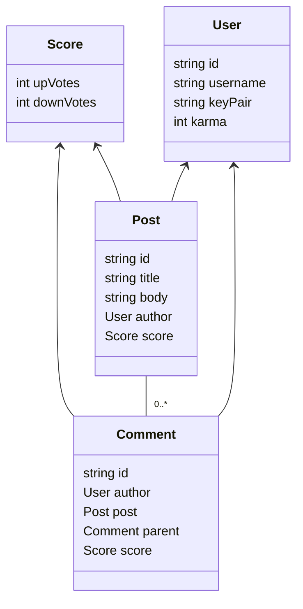

### DB diagram

```mermaid

classDiagram
class Post {
    string id
    string title
    string body
    User author
    Score score
}

class User {
    string id
    string username
    string keyPair
    int karma
}

class Comment {
    string id
    User author
    Post post
    Comment parent
    Score score
}

class Score {
    int upVotes
    int downVotes
}

User <-- Post
Score <-- Comment
Score <-- Post
Post -- "0..*" Comment
User <-- Comment
```
